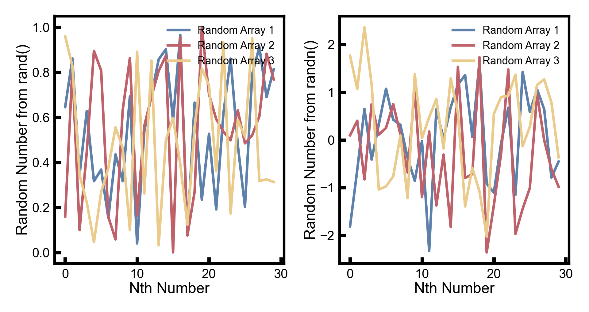

# EavesPlotStyle

Contains code to create publication quality figures in a variety of languages.

## Julia

Before using this Julia plotting code with your project, add `/.CondaPkg/` to your .gitignore file. Otherwise, "too many changes" are detected and you can run into problems. Once you've add this line to your .gitignore file, add the EavesPlotStyle module to your working module. You can add the module directly from GitHub by typing 

```
] add https://github.com/SinaLewis/EavesPlotStyle:julia
```

or with different syntax

```
Pkg.add(url="https://github.com/SinaLewis/EavesPlotStyle", subdir="julia")
```

Once you've added the package, simply type `using EavesPlotStyle` to gain access to all of its functionality.

### Creating a Plot

A few example plots and the code used to generate them are included below.

```
using EavesPlotStyle

xyRand = rand(30, 3)
xyRandN = randn(30, 3)

plt = eaves_plot()


scale = 12

plt.figure(figsize=(2 * scale, 1 * scale)) ## great for creating a 1 row, 2 column set of subplots

ax = plt.subplot(1, 2, 1)
for i in 1:length(xyRand[1, :])
    ax.plot(xyRand[:, i], c=pynord_palette[i], label="Random Array $i")
end
plt.xlabel("Nth Number")
plt.ylabel("Random Number from rand()")
plt.legend(frameon=false, fontsize=25, loc="upper right")

ax = plt.subplot(1, 2, 2)
for i in 1:length(xyRandN[1, :])
    ax.plot(xyRandN[:, i], c=pynord_palette[i], label="Random Array $i")
end

plt.xlabel("Nth Number")
plt.ylabel("Random Number from randn()")
plt.legend(frameon=false, fontsize=25, loc="upper right")

plt.savefig("2x1_subplot_example.png")
```



We can create the same graph using the function `create_panel(w, h, s)` that takes the number of columns (w) and rows (h) and overall scale (s) of the plot as an argument.

```
using EavesPlotStyle

xyRand = rand(30, 3)
xyRandN = randn(30, 3)

xlabels=["Nth Number","Nth Number"]
ylabels=["Random Number from rand()","Random Number from randn()"]

plt,axMat = create_panel(2,1,12,xlabels,ylabels)

for i in 1:length(xyRand[1, :])
    axMat[1][1].plot(xyRand[:, i], c=pynord_palette[i], label="Random Array $i")
end
# switch active axis for edits
plt.axes(axMat[1][1])
plt.legend(frameon=false, fontsize=25, loc="upper right")

for i in 1:length(xyRandN[1, :])
    axMat[1][2].plot(xyRandN[:, i], c=pynord_palette[i], label="Random Array $i")
end
# switch active axis for edits
plt.axes(axMat[1][2])
plt.legend(frameon=false, fontsize=25, loc="upper right")

plt.savefig("2x1_subplot_example2.png")
```

## Matlab
